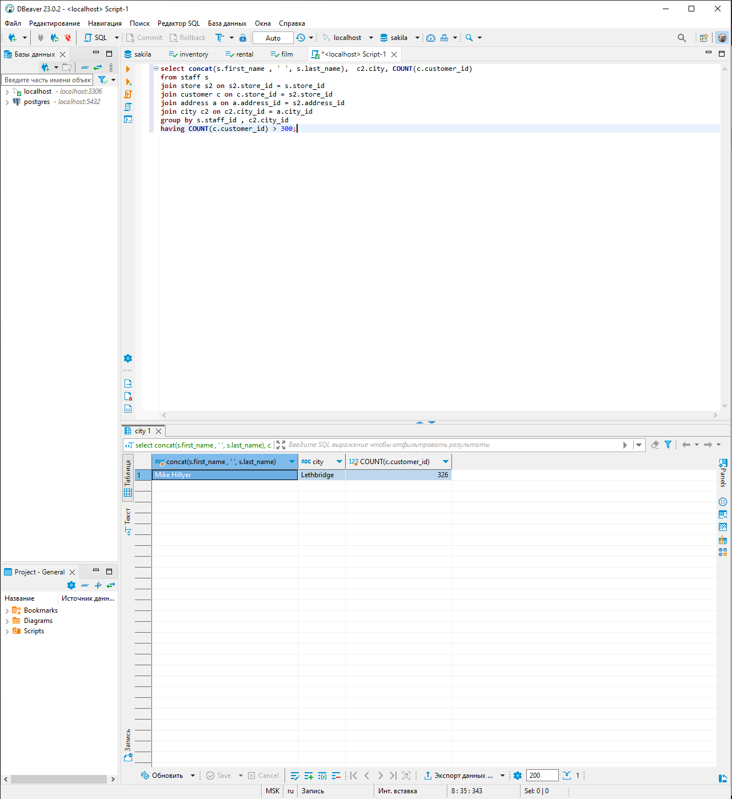
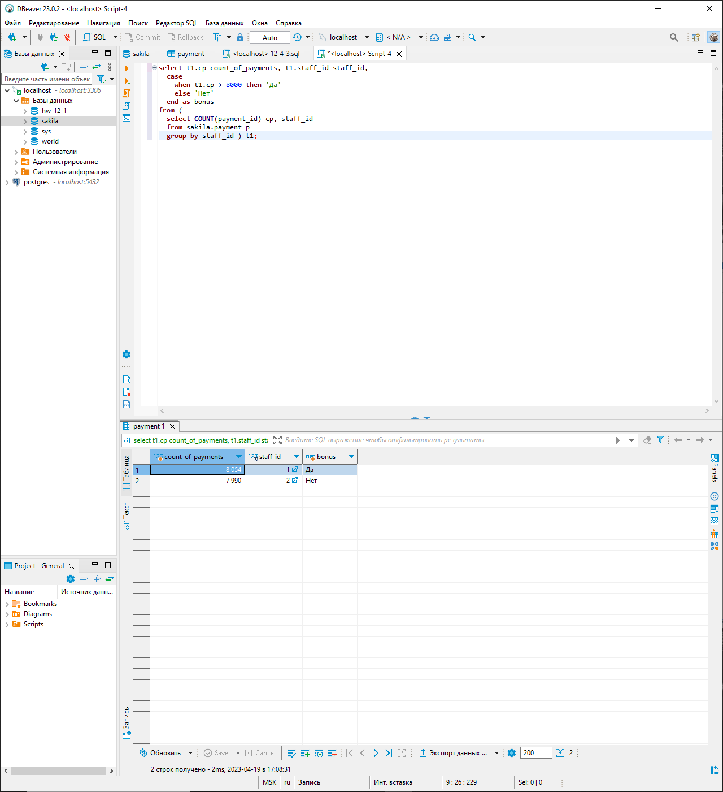
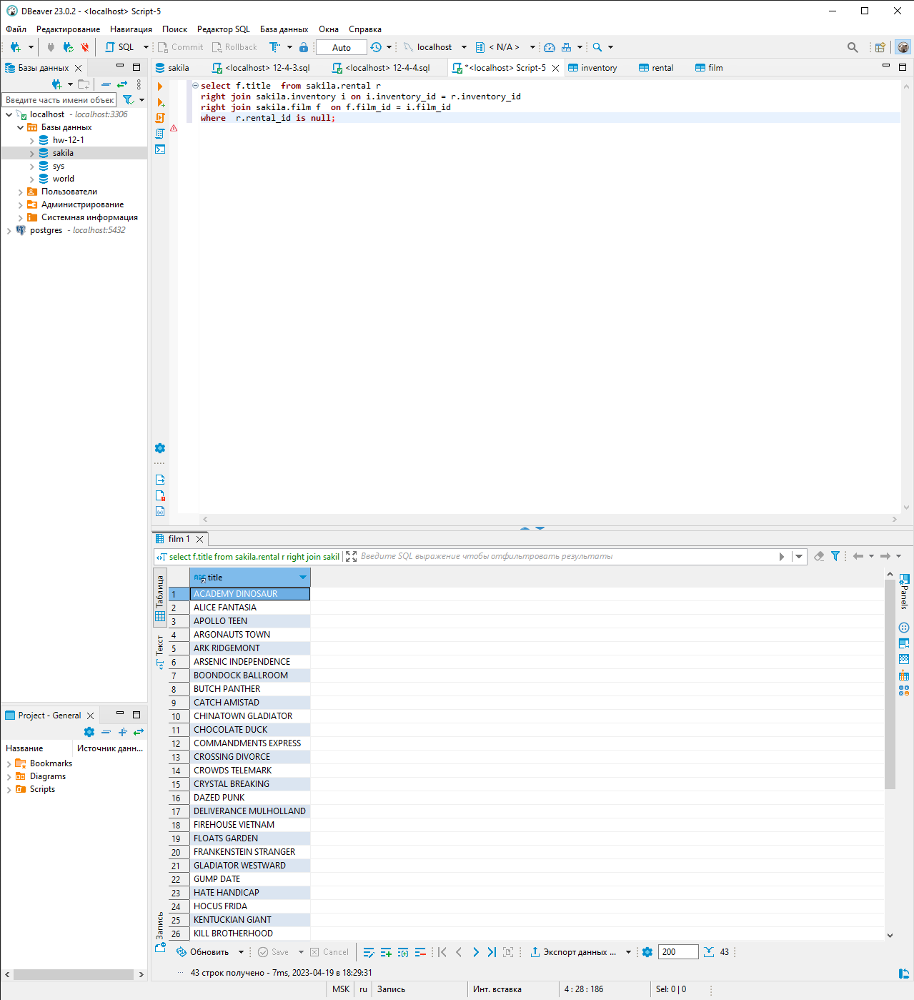

# Домашнее задание к занятию «SQL. Часть 2»

---

Задание можно выполнить как в любом IDE, так и в командной строке.

### Задание 1

Одним запросом получите информацию о магазине, в котором обслуживается более 300 покупателей, и выведите в результат следующую информацию: 
- фамилия и имя сотрудника из этого магазина;
- город нахождения магазина;
- количество пользователей, закреплённых в этом магазине.

```sql
select concat(s.first_name , ' ', s.last_name),  c2.city, COUNT(c.customer_id) 
from staff s
join store s2 on s2.store_id = s.store_id 
join customer c on c.store_id = s2.store_id
join address a on a.address_id = s2.address_id 
join city c2 on c2.city_id = a.city_id 
group by concat(s.first_name, ' ', s.last_name), c2.city
having COUNT(c.customer_id) > 300;
```


---

### Задание 2

Получите количество фильмов, продолжительность которых больше средней продолжительности всех фильмов.
```sql
select COUNT(f.title)
from film f  
where f.`length`  >
  (select AVG(`length`) 
  from film);   
```
 amount_of_payments, MONTH(p.payment_date) month_of_payments
  from sakila.payment p 
  group by month(p.payment_date)) t1
order by t1.amount_of_payments desc  
limit 1;
```


---

## Дополнительные задания (со звёздочкой*)
Эти задания дополнительные, то есть не обязательные к выполнению, и никак не повлияют на получение вами зачёта по этому домашнему заданию. Вы можете их выполнить, если хотите глубже шире разобраться в материале.

### Задание 4*

Посчитайте количество продаж, выполненных каждым продавцом. Добавьте вычисляемую колонку «Премия». Если количество продаж превышает 8000, то значение в колонке будет «Да», иначе должно быть значение «Нет».
```sql
select t1.cp count_of_payments, t1.staff_id staff_id,
  case 
  	when t1.cp > 8000 then 'Да'
  	else 'Нет'
  end as bonus
from (
  select COUNT(payment_id) cp, staff_id  
  from sakila.payment p 
  group by staff_id ) t1;
```


---

### Задание 5*

Найдите фильмы, которые ни разу не брали в аренду.
```sql
select f.title  from sakila.rental r
right join sakila.inventory i on i.inventory_id = r.inventory_id  
right join sakila.film f  on f.film_id = i.film_id 
where  r.rental_id is null;
```

